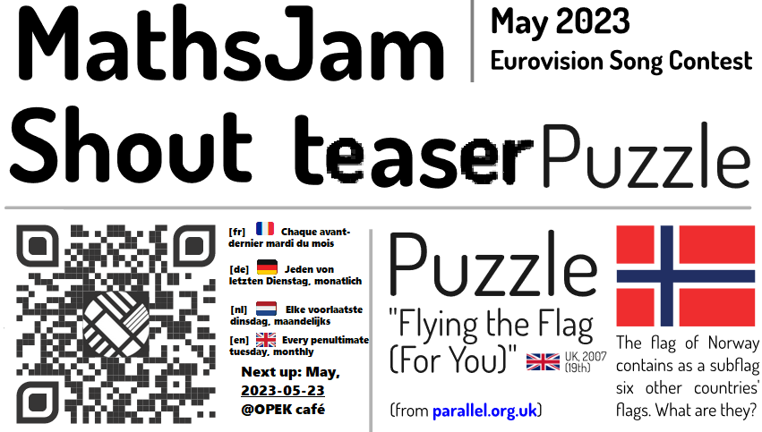

# Welcome! To join Maths Jam Leuven (MJL) get in contact:

## Physical MathsJam 
[fr] 🇫🇷 Chaque avant-dernier mardi du mois 

[de] 🇩🇪 Jeden von letzten Dienstag, monatlich 

[nl] 🇳🇱 Elke voorlaatste dinsdag, maandelijks 

[en] 🇬🇧 Every penultimate tuesday, monthly Coming MathsJams: 23/05, ...

Meet up *physically* on the second to last tuesday of each month in **[OPEK Leuven](https://www.openstreetmap.org/way/94781952)**

## Online

- On our [Signal Private Messenger](https://signal.org/download) [Group](https://signal.group/#CjQKIFqj30BPk5afN4fyrKYd6SfIhKePytDF6dYGJvHulPq8EhDwLRPBvWcbcS6sIc9W3EIg)
- Via email [leuvenMJ@gmail.com](mailto:leuvenMJ@gmail.com)
- Via the parent organisation site: [https://www.mathsjam.com/cities/leuven/](https://www.mathsjam.com/cities/leuven/)
- Via our [own little website](https://leuvenmathsjam.github.io/)
- You can point people to here with this QR-code:

